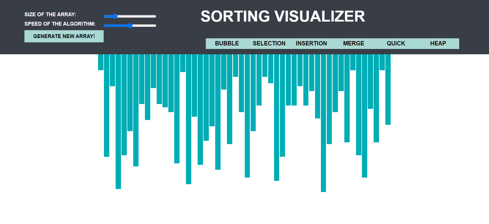
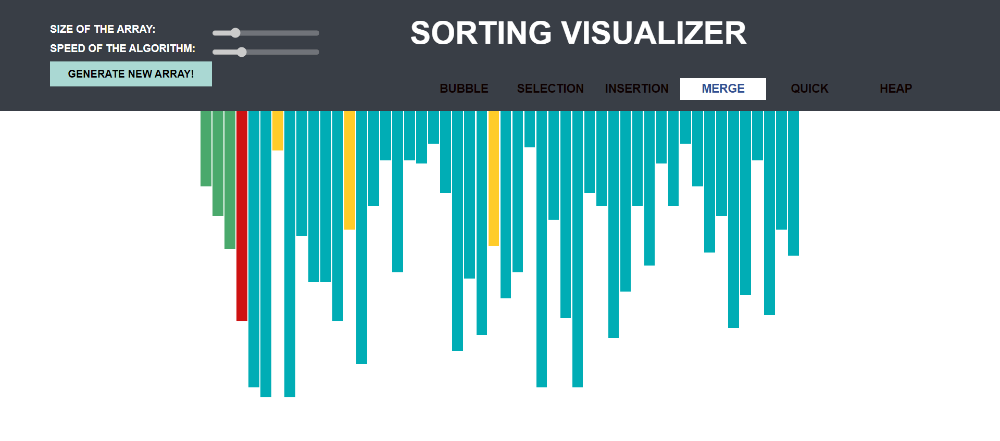

# SortingVisualizer

<h4>
  A visual representation of all the sorting algorithms.
</h4>

I built this application because I was fascinated by sorting algorithms, and I wanted to visualize their working in action. It is reflective of how fast and effective each of these sorting  algorithms are. I enjoyed building it. You can access it here <a href = "https://shambhawibhure.github.io/SortingVisualizer/"  target="_blank">SORTING VISUALIZER</a>

<!-- ABOUT THE PROJECT -->
## About The Project

You can generate a new array with varied array size and then visualize these six sorting algorithms on it - <strong>Bubble, Selection, Insertion, Merge, Quick, Heap</strong>.

  <kbd>
    
  </kbd>

 

In the image below, merge sort is currenlty applied to a randomly created array and currently we can see three coloured columns. What do they represent?

<ul>
  <li>Yellow bars - When the algorithm is looking at particular bars at the moment, it is marked as yellow.</li>
  <li>Red bars - If a particular bar is changing, it is marked as red.</li>
  <li>Green bars - When the bar reaches it's final position where it is supposed to be, it is marked as green.</li>
</ul>

  <kbd>
    
  </kbd>

 

<strong>Speed of the algorithm</strong> button allows us to see step by step how each algorithm works.

<!-- LEARNINGS FOR ME -->
## What I learnt!
<ul>
  <li>Brushed up upon the concepts of HTML, CSS, Javascript</li>
  <li>Brushed up upon my sorting algorithm concepts</li>
  <li>Learnt about DOM Manipulation</li>
  <li>Separation of concerns - Breaking the source code into different smaller blocks which are logically related(and putting in different files) so that it gets easier in spotting errors, debugging them and making changes in the code.</li>
</ul>

